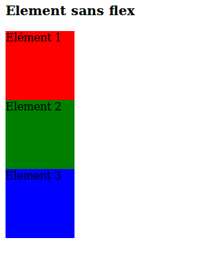
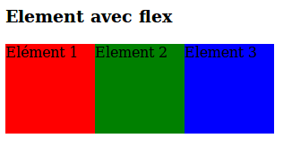

# flexbox

## Mise en page avec flexbox

### Un conteneur, des éléments

1. Il faut définir un conteneur et placer à l'intérieur plusieurs éléments.

    

      
Elément 1

      
Elément 2

      
Elément 3

    

    

#### Rajoutons du flex
dans le css on cible le parent (le container)
    #container{
      display:flex;
    }

2. Les exemples
  + Dossier flexbox-playground pour tester en direct
  + Le fichier index.html :exemple simple
  + Liens/cours en ligne :
    + [S'entrainer avec une grenouille]('http://flexboxfroggy.com/')
    + [Guide Flexbox]('https://css-tricks.com/snippets/css/a-guide-to-flexbox/')
    + [Cours de openclassrooms] ('https://openclassrooms.com/courses/apprenez-a-creer-votre-site-web-avec-html5-et-css3/la-mise-en-page-avec-flexbox')
    + [w3schools]('https://www.w3schools.com/css/css3_flexbox.asp')
    + [codepen]('https://codepen.io/enxaneta/pen/adLPwv?q=flexbox&limit=all&type=type-pens')
